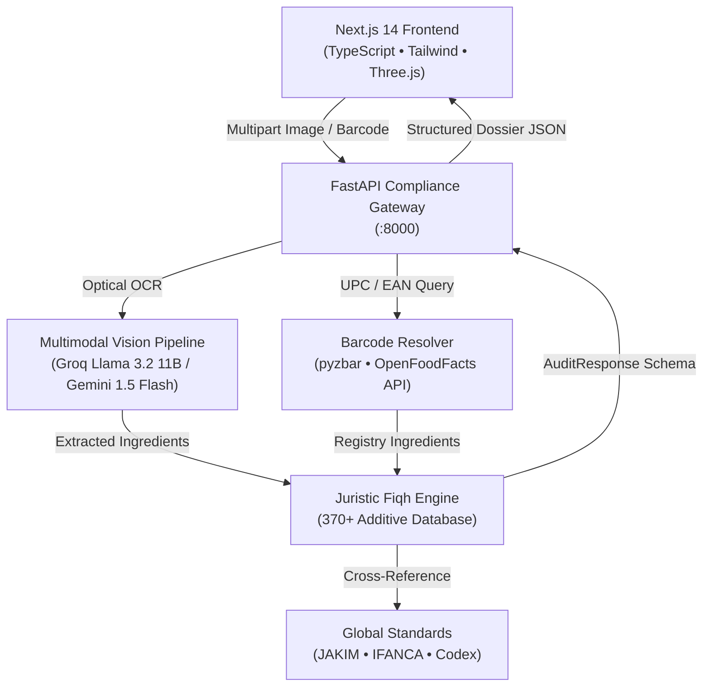

# TaqwaLens — Automated Halal Ingredient & E-Code Compliance Auditor

<div align="center">


**An institutional, production-grade dietary transparency platform empowering mindful consumers to audit food packaging labels and retail barcodes against authoritative Islamic juristic standards.**

🌐 **Live Deployment:** [https://taqwa-lens.vercel.app](https://taqwa-lens.vercel.app)

[Features](#-key-features) • [Architecture](#-architecture) • [3D Spatial Experience](#-3d-spatial-experience) • [Multi-Madhhab Engine](#-multi-madhhab-juristic-engine) • [Quick Start](#-quick-start) • [API Reference](#-api-reference)

</div>

---

## 🌟 Executive Summary

TaqwaLens bridges modern computer vision and authoritative Islamic jurisprudence. Using optical character recognition (OCR) and multimodal vision models, it inspects ingredient declarations on grocery packaging, screens **370+ indexed food additives (E-codes)**, checks global retail barcodes against international registries, and provides nuanced cross-madhhab compliance assessments aligned with international authorities (JAKIM MS 1500, IFANCA, Codex Alimentarius).

---

## ✨ Key Features

### 🔍 1. Dual-Modal Optical Inspection Bay
* **High-Res Packaging OCR**: Upload any grocery packaging photo or use the in-store smartphone camera to extract complex ingredient panels with optical laser scanline HUD telemetry.
* **Retail Barcode (UPC/EAN) Scanning**: Fast barcode detection powered by `pyzbar` with live fallback to OpenFoodFacts international food database.
* **Anti-Hallucination Guardrails**: Rejects non-food or unreadable images with strict `HTTP 422` error envelopes, preventing LLM verdict guessing.

### ⚖️ 2. Nuanced Multi-Madhhab Juristic Engine
* **Juristic Customization**: Evaluates additive origins and rulings across all primary Sunni legal schools:
  * **Standard (Global Consensus)**: Aligned with international Halal certifying bodies.
  * **Hanafi**: Strict rulings on non-plant rennet and insect-derived colorants (e.g., E120 Carmine).
  * **Shafi'i**: Focus on animal slaughter verification and gelatin origins.
  * **Strict (Wara' / Scrupulousness)**: Flagging any synthetic or ambiguous processing aids.
* **370+ Indexed Additives**: Deep classification database tracking animal, plant, microbial, and synthetic derivations.

### 🎨 3. Spatial 3D Interactive UI & Audio
* **3D Packaging Carton (`ProductLens3D`)**: An artisan botanical food carton with an authentic gable roof, brass magnifying glass, laser sweep beam, and real-time cursor parallax.
* **3D Halal Trust Seal (`Compliance3DShowcase`)**: A metallic gold & emerald 8-pointed *Rub el Hizb* star medallion with 100% upright Arabic calligraphy (`حلال`), gentle pendulum oscillation, and automatic spring-back physics.
* **3D Welcome Gateway (`AuthCard3D`)**: Interactive dual-sided flipping credential badge with gold-foil shader and personalized Madhhab selection.
* **Procedural Web Audio Engine**: Tactile shutter clicks, pop sounds, and authentic Halal/Mushbooh/Haram tonal feedback.

### 📜 4. Institutional Compliance Dossier & Certificate
* **Full-Width Audit Findings**: Clear visual breakdown featuring high-impact 3D tilt verdict cards, flagged additive warnings, and expandable ingredient chips.
* **Dedicated Printable Certificate (`/certificate`)**: Formatted as an official verification diploma with legal border, live animated gold seal, unique dossier ID (`TL-XXXXX-2026`), and native print-to-PDF.
* **1-Click Brand Inquiry Drawer**: Generates pre-composed customer care emails and 280-character X/Twitter posts for ambiguous (*Mushbooh*) ingredients, with 1-click clipboard copy.
* **Ask Sheikh AI**: Interactive in-context juristic assistant explaining additive chemistry and classical Fiqh rulings.

---

## 🏛️ Architecture



---

## 🚀 Quick Start

### Prerequisites
* **Python 3.10+** (tested on Python 3.12 / 3.14)
* **Node.js 18+** & `npm`
* API Keys: Groq API Key and/or Google Gemini API Key

### 1. Clone & Configure
```bash
git clone https://github.com/lizzz-dev/taqwalens.git
cd taqwalens
```

Create a root `.env` file:
```env
GROQ_API_KEY=your_groq_api_key_here
GEMINI_API_KEY=your_gemini_api_key_here
```

### 2. Launch Backend (FastAPI)
```bash
# Set up virtual environment
python -m venv backend/venv

# Activate on Windows
backend\venv\Scripts\activate
# Or on Linux/macOS:
# source backend/venv/bin/activate

# Install dependencies
pip install -r backend/requirements.txt

# Run backend service
uvicorn backend.main:app --host 0.0.0.0 --port 8000 --reload
```
* Backend API Documentation: `http://localhost:8000/docs`
* Health Check: `http://localhost:8000/health`

### 3. Launch Frontend (Next.js)
```bash
cd frontend
npm install
npm run dev
```
* Web Application: `http://localhost:3000`

---

## 🧪 Automated Test Suite

The backend includes a comprehensive automated test suite verifying Pydantic payload boundaries, OCR image preprocessing, Fiqh cross-matching, and non-food guards:

```bash
# Run backend pytest suite
backend\venv\Scripts\pytest.exe backend\tests -v
```
**Results**: `18 passed in 1.87s (100% pass rate)`

```bash
# Run Next.js production build verification
npm --prefix frontend run build
```
**Results**: `Compiled successfully in 1.9s (0 TypeScript errors)`

---

## 📱 Mobile & PWA Ready

* **Single-Row Responsive Navbar**: Auto-collapses search, Fiqh selector, tools, and profile on narrow 375px screens.
* **Smartphone Camera Support**: Uses WebRTC rear camera (`facingMode: "environment"`) for live supermarket scanning.
* **Touch-Pan-Y Safeguards**: Enables natural page scrolling across all 3D WebGL viewports.
* **Native Print-to-PDF**: On iOS and Android, the `/certificate` page triggers the system print spooler for instant PDF saving.

---

## 📄 License & Institutional Notice

TaqwaLens is built for educational ingredient transparency and consumer awareness. It references established international standards (JAKIM MS 1500:2019, IFANCA, Codex Alimentarius). It is not a substitute for direct rabbinical/halal certification audits or formal religious decrees (fatwas).
